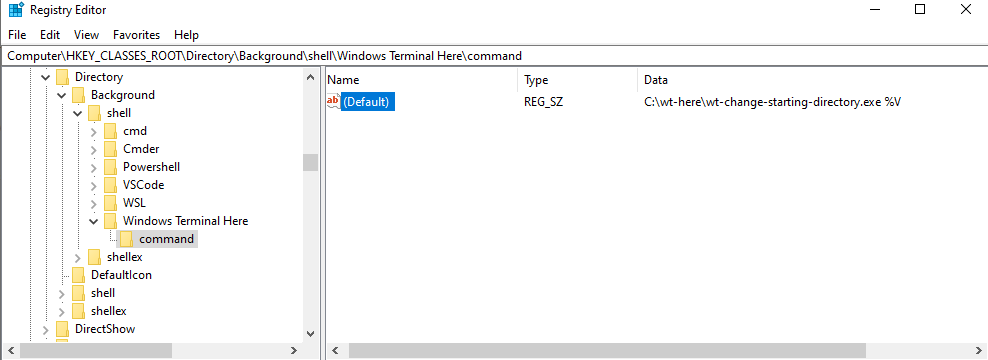

# open windows terminal here

this small program changes the value of `startingDirectory` in profiles.json before starting windows terminal.

For it to work, you need to modify the registry(before any action, make a copy of the registry)

1. run `regedit.exe`
2. create a new key in `Computer\HKEY_CLASSES_ROOT\Directory\Background\shell` and name it (the name will be the title in the context menu)
3. add a sub-key and name it "command"
4. to the (Default) value assign this string: `<path_to_directory_with_this_program>\wt-change-starting-directory.exe %V`

